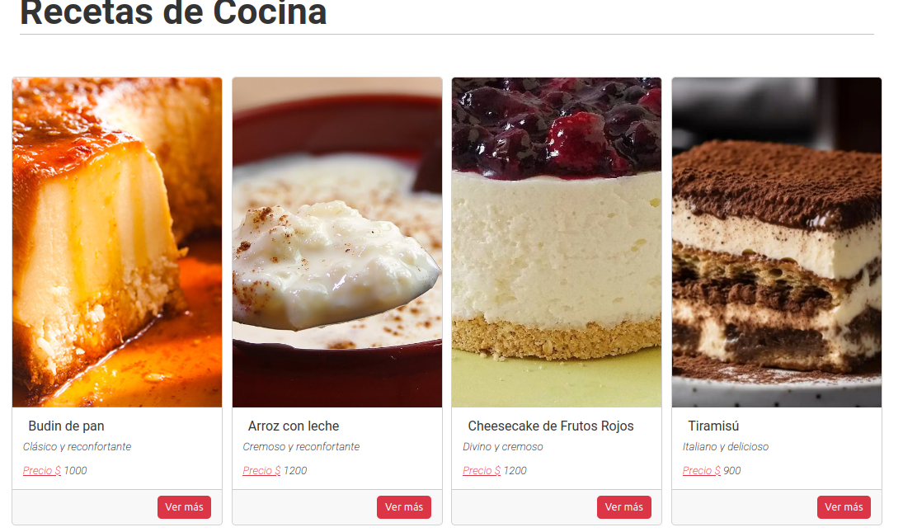
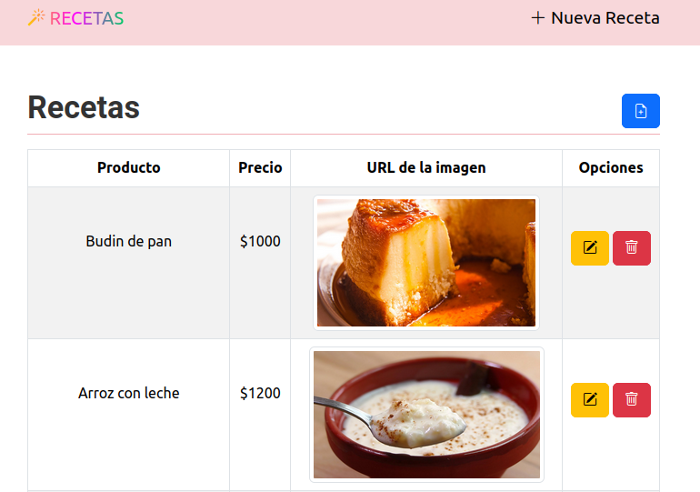

# Frontend del CRUD de Recetas de Cocina

Este proyecto consiste en la parte frontend de la práctica de un CRUD de Recetas de Cocina. Utilizando diversas bibliotecas y herramientas para construir una interfaz de usuario dinámica e interactiva. Este proyecto se desarrollo principalmente con **[react](https://www.npmjs.com/package/react):** Biblioteca JavaScript para construir interfaces de usuario.


## Descripción del CRUD de Lista de Tareas

El frontend de esta aplicación implementa un sistema CRUD (Crear, Leer, Actualizar, Eliminar) para administrar tarjetas decriptivas de recetas de cocina. Utiliza solicitudes Fetch para comunicarse con el backend, permitiendo al usuario realizar las siguientes operaciones:

- **Crear Card Receta:** Permite al usuario agregar una nueva tarea a la lista.
- **Leer Cards Recetas:** Muestra la lista completa de tareas almacenadas en el backend.
- **Actualizar Recetas:** Permite al usuario editar una tarea existente.
- **Eliminar Recetas:** Permite al usuario eliminar una tarea de la lista.
Estas operaciones se realizan mediante solicitudes HTTP al backend, que gestiona la lógica y la persistencia de los datos en la base de datos.




## Demo

Puedes ver una demostración del proyecto en el siguiente enlace: [Demo](https://recetas-cocina.netlify.app/)


## Dependencias Utilizadas

- **[@fortawesome/free-solid-svg-icons](https://www.npmjs.com/package/@fortawesome/free-solid-svg-icons):** Proporciona iconos de FontAwesome para la interfaz de usuario.
- **[bootstrap](https://www.npmjs.com/package/bootstrap):** Framework CSS para estilizar la aplicación.
- **[bootstrap-icons](https://www.npmjs.com/package/bootstrap-icons):** Proporciona iconos de Bootstrap para la interfaz de usuario.
- **[react-bootstrap](https://www.npmjs.com/package/react-bootstrap):** Implementa los componentes de Bootstrap en React.
- **[react-dom](https://www.npmjs.com/package/react-dom):** Proporciona el DOM virtual de React para renderizar componentes.
- **[react-hook-form](https://www.npmjs.com/package/react-hook-form):** Librería para manejar formularios en React.
- **[react-router-dom](https://www.npmjs.com/package/react-router-dom):** Biblioteca de enrutamiento para React.
- **[sweetalert2](https://www.npmjs.com/package/sweetalert2):** Biblioteca para mostrar ventanas modales en la aplicación.
- **[react-spinners](https://github.com/penguinEm/Tp7_backendRecetasDeCocina.git):** Biblioteca para mostrar ventanas spinners de carga en la aplicación.


Para instalar todas las dependencias del proyecto, ejecuta el siguiente comando desde la terminal, en la raíz de tu proyecto:

```bash
npm install @fortawesome/free-solid-svg-icons bootstrap bootstrap-icons react react-bootstrap react-dom react-hook-form react-router-dom sweetalert2 react-loader-spinner
```
## Repositorios

- [Backend](https://github.com/penguinEm/Tp7_backendRecetasDeCocina.git): Enlace al repositorio del backend.
- [Frontend](https://github.com/penguinEm/tp7_frontRecetasDeCocina.git): Enlace al repositorio del frontend.